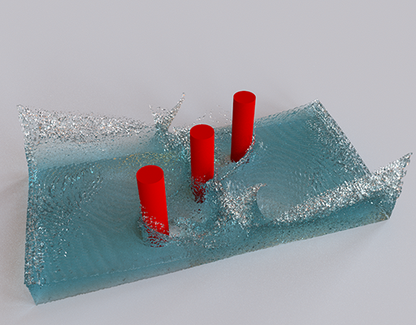
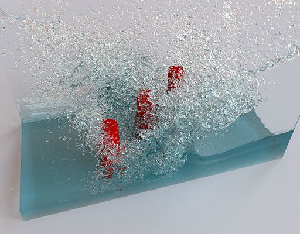
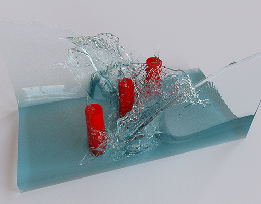
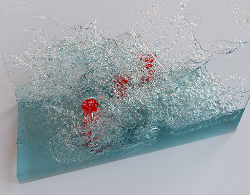
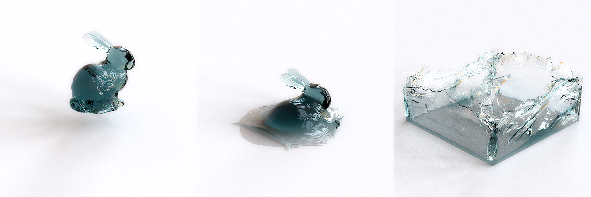

# CubbyFlow


[](./LICENSE) [](https://travis-ci.org/utilForever/CubbyFlow/branches) [](https://ci.appveyor.com/project/utilForever/CubbyFlow/branch/master) [](https://discord.gg/3gsWZM8)

[](https://codecov.io/gh/utilForever/CubbyFlow)
[](https://www.codacy.com/manual/utilForever/CubbyFlow?utm_source=github.com&amp;utm_medium=referral&amp;utm_content=utilForever/CubbyFlow&amp;utm_campaign=Badge_Grade)
[](https://lgtm.com/projects/g/utilForever/CubbyFlow/alerts/)
[](https://lgtm.com/projects/g/utilForever/CubbyFlow/alerts/)
[](https://www.codefactor.io/repository/github/utilforever/CubbyFlow)

CubbyFlow is voxel-based fluid simulation engine for computer games based on [Jet framework](https://github.com/doyubkim/fluid-engine-dev) that was created by [Doyub Kim](https://twitter.com/doyub).
The code is built on C++17 and can be compiled with commonly available compilers such as g++, clang++, or Microsoft Visual Studio. CubbyFlow currently supports macOS (10.12.6 or later), Ubuntu (17.04 or later), Windows (Visual Studio 2017 or later), and Windows Subsystem for Linux (WSL). Other untested platforms that support C++17 also should be able to build CubbyFlow.

## Key Features

- Basic math and geometry operations and data structures
- Spatial query accelerators
- SPH and PCISPH fluid simulators
- Stable fluids-based smoke simulator
- Level set-based liquid simulator
- PIC, FLIP, and APIC fluid simulators
- Upwind, ENO, and FMM level set solvers
- Jacobi, Gauss-Seidel, SOR, MG, CG, ICCG, and MGPCG linear system solvers
- Spherical, SPH, Zhu & Bridson, and Anisotropic kernel for points-to-surface converter
- Converters between signed distance function and triangular mesh
- C++ and Python API
- Intel TBB, OpenMP, HPX and C++11 multi-threading backends

Every simulator has both 2-D and 3-D implementations.

## Quick Start

You will need CMake to build the code. If you're using Windows, you need Visual Studio 2017 in addition to CMake.

First, clone the code:

```
git clone https://github.com/utilForever/CubbyFlow.git --recursive
cd CubbyFlow
```

### C++ API

For macOS or Linux or Windows Subsystem for Linux (WSL):

```
mkdir build
cd build
cmake ..
make
```

For Windows:

```
mkdir build
cd build
cmake .. -G"Visual Studio 15 2017 Win64"
MSBuild CubbyFlow.sln /p:Configuration=Release
```

Now run some examples, such as:

```
bin/HybridLiquidSim
```

### Python API

Build and install the package by running

```
pip install -U .
```

### Docker

```
docker pull utilforever/cubbyflow:latest
```

Now run hybrid simulation example:

```
docker run -it utilforever/cubbyflow
[inside docker container]
/app/build/bin/HybridLiquidSim
```


### More Instructions of Building the Code

To learn how to build, test, and install the SDK, please check out [INSTALL.md](./Documents/Install.md).

## Documentation

All the documentations for the framework can be found from [the project website](https://utilforever.github.io/CubbyFlow/) incluing the API reference.

## Examples

Here are some of the example simulations generated using CubbyFlow framework. Corresponding example codes can be found under [Examples](./Examples). All images are rendered using [Mitsuba renderer](https://www.mitsuba-renderer.org/) and the Mitsuba scene files can be found from [the demo directory](./Demos). Find out more demos from [the project website](https://utilforever.github.io/CubbyFlow/Examples).

#### PCISPH Simulation Example



#### Level Set Simulation Example


#### FLIP Simulation Example



#### PIC Simulation Example



#### APIC Simulation Example



#### Level Set Example with Different Viscosity (high / low)




#### Smoke Simulation with Different Advection Methods (Linear / Cubic-Spline)


## Presentations

  * [NDC 2018](https://www.slideshare.net/utilforever/ndc-2018-95260566)

## Articles

  * NDC 2018
    * [[NDC2018] 유체역학 엔진이 직면한 문제와 미래](http://www.inven.co.kr/webzine/news/?news=198413)
    * [[NDC18] 게임에 쓸 수 있는 유체역학 엔진, 어렵지만 꿈은 아니다](http://www.gamevu.co.kr/news/articleView.html?idxno=8464)

## How To Contribute

Contributions are always welcome, either reporting issues/bugs or forking the repository and then issuing pull requests when you have completed some additional coding that you feel will be beneficial to the main project. If you are interested in contributing in a more dedicated capacity, then please contact me.

## Contact

You can contact me via e-mail (utilForever at gmail.com). I am always happy to answer questions or help with any issues you might have, and please be sure to share any additional work or your creations with me, I love seeing what other people are making.

## License


The class is licensed under the [MIT License](http://opensource.org/licenses/MIT):

Copyright &copy; 2020 [Chris Ohk](http://www.github.com/utilForever).

Permission is hereby granted, free of charge, to any person obtaining a copy of this software and associated documentation files (the "Software"), to deal in the Software without restriction, including without limitation the rights to use, copy, modify, merge, publish, distribute, sublicense, and/or sell copies of the Software, and to permit persons to whom the Software is furnished to do so, subject to the following conditions:

The above copyright notice and this permission notice shall be included in all copies or substantial portions of the Software.

THE SOFTWARE IS PROVIDED "AS IS", WITHOUT WARRANTY OF ANY KIND, EXPRESS OR IMPLIED, INCLUDING BUT NOT LIMITED TO THE WARRANTIES OF MERCHANTABILITY, FITNESS FOR A PARTICULAR PURPOSE AND NONINFRINGEMENT. IN NO EVENT SHALL THE AUTHORS OR COPYRIGHT HOLDERS BE LIABLE FOR ANY CLAIM, DAMAGES OR OTHER LIABILITY, WHETHER IN AN ACTION OF CONTRACT, TORT OR OTHERWISE, ARISING FROM, OUT OF OR IN CONNECTION WITH THE SOFTWARE OR THE USE OR OTHER DEALINGS IN THE SOFTWARE.
